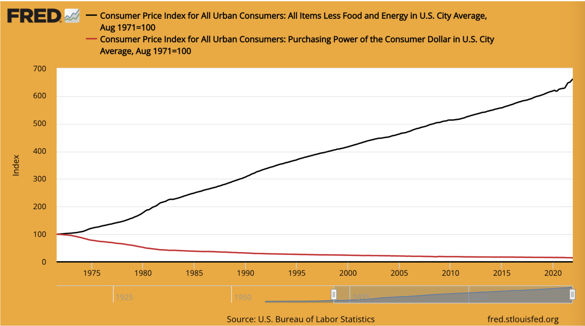

# لماذا نحتاج البيتكوين

> `المشكلة الجذرية في العملة التقليدية هي كافة الثقات المتتطلبة لجعلها تعمل. يجب أن يثق بالبنك المركزي لعدم تخريب العملة، ولكن تاريخ العملات الورقية مليء بانتهاكات لهذه الثقة. يجب أن نثق بالبنوك للحفاظ على أموالنا ونقلها إلكترونيا, ولكنهم يقدمونها في موجات من الفقاعات الائتمانية مع جزء ضئيل فقط كاحتياط. علينا أن نثق بهم فيما يتعلق بخصوصيتنا، ونثق بهم في عدم السماح للمحتالين بسحب حساباتنا`

> ساتوشي ناكاموتو

* نظام النقد الحالي معطوب وتالف (وكان دائماً كذلك)
* انه ليس مستدام (لم يكن أبداً)
* لا توجد طريقة لإصلاحه (ولن تكون أبداً)

## المعيار (الغير) الذهبي

* معظم الناس مازالو يعتقدون ان النقود مدعومة بالذهب
* هذا ليس صحيحا
* It has not been backed by gold since 1971, when President Nixon unilaterally took the world off the gold standard (the
  Nixon Shock).
* See wtfhappenedin1971.com to get a clear picture of the damage this did.

> Chart showing CPI inflation (black line) vs the purchasing power of the dollar (red line) since 1971.

- Fun Fact: The WEF was formed in 1971.

---

::: warning FIAT: (noun) /ˈfiː.æt/

: an authoritative or arbitrary order : DECREE

: an authoritative determination : DICTATE

: **a command or act of will that creates something without
or as if without further effort**
:::

> ~ merriam-webster.com/dictionary

---

## FROM THE HORSE’S MOUTH OF OLDE

::: warning ""
The bank hath benefit of interest on all monies
that it creates out of nothing.
:::
> ~ William Paterson, 1694, Founder of the Bank of England

::: warning ""
All of the perplexities, confusion, and distress in America arises, not
from the defects of the Constitution or Confederation, not from the
want of honor or virtue,
so much as from downright ignorance of
the nature of coin, credit, and circulation.
:::
> ~ John Adams, 2nd President of the United States, 1735−1826

---

## THE FEDERAL RESERVE

* The Fed is the ‘independent’ central bank of the US. It was created in 1913 with the passing of the Federal Reserve
  Act.
* It has a unique structure, part private and part government.
* It is supposed to be a politically independent, non-partisan entity within the government.
* While the Fed Board of Governors is appointed by the President and confirmed by Congress, **the decisions
  of the Fed do not need to be ratified by anyone. Yes, it is confusing!**
